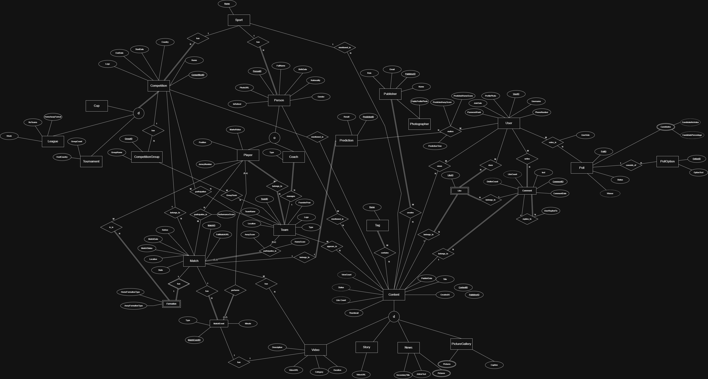

# DB-Project-Varzesh3

An Entity-Relationship data model for the multi-sport news and community platform, [Varzesh3](https://www.varzesh3.com/) website. The design covers the full domain — from competitions and match data to user-generated content, predictions, and community interaction — structured into five logical subsystems.

---

## ER Diagram



> Source file: [`diagrams/DB-Phase1.drawio`](diagrams/DB-Phase1.drawio) (open with [draw.io](https://app.diagrams.net/))

---

## Subsystems

### 1. Sports Structure
Manages the competitive hierarchy of the platform.

| Entity | Description |
|---|---|
| `Sport` | Top-level sport category (e.g. Football, Basketball) |
| `Competition` *(superclass)* | Organized competition; disjoint subtypes: **League**, **Cup**, **Tournament** |
| `Team` | Club or national team participating in competitions |
| `Match` | A scheduled game between exactly two teams |
| `Formation` | Tactical formation record per match (1:1 with Match) |
| `MatchEvent` | Individual in-match events (goals, cards, substitutions) |

### 2. People Management
Models every individual associated with the platform.

| Entity | Description |
|---|---|
| `Person` *(superclass)* | Any individual; overlapping subtypes: **Player** and **Coach** |
| `Player` | Team-sport athlete with position, jersey number, and market value |
| `Coach` | Team coach with type (Head, Assistant, etc.) |
| `Publisher` | Editorial staff who create content |
| `Photographer` | Media contributor for images; subclass of Publisher |

### 3. Content Management
Handles all published media on the platform.

| Entity | Description |
|---|---|
| `Content` *(superclass)* | All media items; disjoint subtypes: **News**, **Story**, **Video**, **PictureGallery** |
| `News` | News articles with article text and optional subtitle |
| `Story` | Short-lived story posts |
| `Video` | Video posts with URL, duration, and category |
| `PictureGallery` | Photo gallery; linked to individual `Picture` records |
| `Tag` | Keywords for content, linked via `ContentTag` join table |

### 4. User Interaction
Covers all community and engagement features.

| Entity | Description |
|---|---|
| `User` | Registered platform user |
| `Comment` | User comment on content; supports threaded replies (recursive) |
| `Like` | Join table recording user likes on content items |
| `Poll` | Community poll created by a user |
| `PollOption` | Individual choice within a poll |
| `PollVote` | Records a user's vote on a poll option |

### 5. Prediction System
Allows users to forecast match outcomes.

| Entity | Description |
|---|---|
| `Prediction` | A user's forecast for a match result, with timestamp and reasoning |

---

## Key Design Decisions

- **Disjoint vs. Overlapping specializations:** `Competition` and `Content` use *disjoint* specialization (each instance is exactly one subtype). `Person → Player/Coach` is *overlapping* (a person can hold both roles simultaneously).
- **1NF normalization:** Multivalued attributes from the original model (poll candidates, gallery pictures, competition groups) have been extracted into dedicated entities (`PollOption`, `Picture`).
- **Player–Team history:** The Player–Team relationship is modeled as a many-to-many with a `PlayerTeamHistory` join table, supporting start/end dates for tracking transfers.
- **Match–Team constraint:** Each `Match` involves exactly two `Team` records — enforced via two FKs (`TeamID1`, `TeamID2`) or a `MatchTeam` associative table.
- **Threaded comments:** `Comment` has a self-referencing `ParentCommentID` FK to support nested replies.

---

## Relationship Summary

| Relationship | Cardinality | Notes |
|---|---|---|
| Sport → Competition | 1 : N | Each Competition belongs to one Sport |
| Competition → Match | 1 : N | Each Match belongs to one Competition |
| Match ↔ Team | M : N (2:2) | Exactly two Teams per Match |
| Match → MatchEvent | 1 : N | |
| Match → Formation | 1 : 1 | |
| Person ↔ Team (via Player) | M : N | Via `PlayerTeamHistory` |
| Team → Coach | 1 : N | Each Coach belongs to one Team |
| Content → Publisher | N : 1 | |
| Content ↔ Tag | M : N | Via `ContentTag` |
| Content → Comment | 1 : N | |
| Comment → Comment | 1 : N | Recursive (threaded replies) |
| User ↔ Content (via Like) | M : N | Via `Like` table |
| Poll → PollOption | 1 : N | |
| User ↔ PollOption (via PollVote) | M : N | |
| User → Prediction | 1 : N | |
| Match → Prediction | 1 : N | |

---

## Repository Structure

```
sports-db-phase1/
├── README.md
├── docs/
│   └── Documentation.md      # Full entity-by-entity design documentation
└── diagrams/
    ├── DB-Phase1.drawio       # Editable ER diagram (draw.io)
    └── DB-Phase1.png          # Exported diagram image
```

---

## Full Documentation

See [`docs/Documentation.md`](docs/Documentation.md) for the complete specification, including:
- Detailed attribute lists (PKs, FKs, types) for every entity
- Business rules per entity
- Inconsistencies found in the original diagram and recommended fixes
- Mermaid ER diagram snippet
