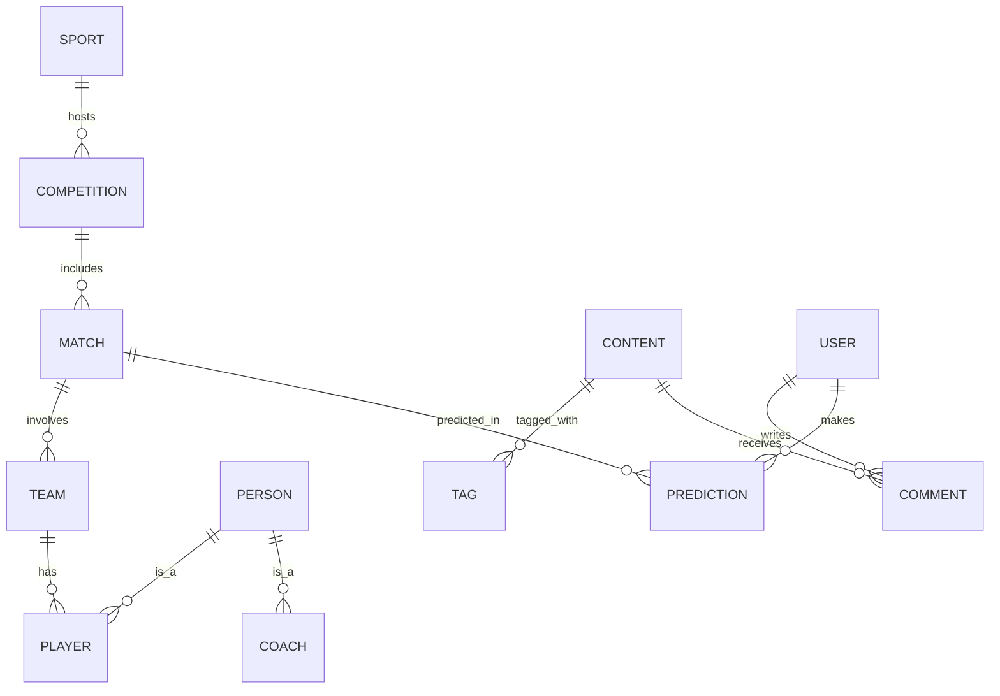

# Executive Summary  

This revision restructures the data model documentation into five logical subsystems (Sports Structure, People Management, Content Management, User Interaction, Prediction System) for clarity.  We normalize problematic attributes (e.g. multivalued “candidates” or “groups”) into separate entities to enforce first normal form. Specializations are explicitly labeled **disjoint** or **overlapping** with justifications: for example, a **Person** can be both a Player and a Coach (overlapping), whereas a **Content** item is exactly one of (News, Story, Video, PictureGallery) (disjoint).  Each entity section below lists its purpose, key attributes (PK/FKs noted), relationships (with cardinalities) and business rules.  A comprehensive relationship summary table follows.  We also highlight inconsistencies between the original ER diagram and the documentation (e.g. missing attributes like prediction timestamps, improper multi-valued fields) and recommend fixes.  Finally, we include a sample **Player–Team history** table (with start/end dates) and a short Mermaid ER diagram snippet.  The goal is a concise, academic-style design ready for grading or defense.

  

## Sports Structure Subsystem  

  

### Sport  

- **Purpose:** Top-level category for different sports (e.g. football, basketball). Prevents schema duplication across sports.  

- **Attributes:**  

  - *SportID* (PK) – unique sport identifier.  

  - Name – e.g. “Football”, “Basketball”.  

- **Relationships:**  

  - **Sport–Competition (1:N):** A Sport hosts many Competitions; each Competition belongs to one Sport.  

  - **Sport–Person (1:N):** Many Persons (players, coaches, etc.) may be associated with a Sport; each Person is tied to one primary Sport.  *(Optional: model if needed for e.g. sports-specific roles.)*  

  - **Sport–Publisher (1:N):** Many Publishers may specialize in a Sport; each Publisher covers one Sport.  

- **Business Rules:**  A new Sport entity is created only when the system adds a new sport category, avoiding redundancy across domains.

  

### Competition *(superclass)*  

- **Purpose:** Represents an organized competition or league. Supports multi-sport competitions.  

- **Attributes:**  

  - *CompetitionID* (PK)  

  - Name  

  - Country  

  - StartDate, EndDate  

  - LogoURL  

  - Type – one of {League, Cup, Tournament} (to indicate subclass type).  

- **Specialization:** Disjoint (each Competition is exactly one subtype).  

- **Subclasses (Disjoint):** **League**, **Cup**, **Tournament**.  

- **Relationships:**  

  - **Competition–Sport (N:1):** Each Competition is for one Sport; each Sport has many Competitions.  

  - **Competition–Match (1:N):** A Competition contains many Matches; each Match belongs to one Competition.  

- **Business Rules:**  Only one subtype applies. E.g. “Premier League” is a League, not also a Cup.  

  

#### League (subclass of Competition)  

- **Additional Attributes:**  

  - Week (current round/week)  

  - HomeAwayFormat (Boolean or enum) – indicates if teams play home-and-away.  

  - NumberOfTeams (expected teams).  

- **Purpose:** League competitions with recurring rounds (e.g. seasons).  

  

#### Cup (subclass of Competition)  

- **Purpose:** Knockout or hybrid tournaments, often with group stages.  
  

#### Tournament (subclass of Competition)  

- **Additional Attributes:**  

  - HostCountry  

  - GroupCount (number of groups/stages).  

- **Purpose:** One-off or short-term competitions (e.g. World Cup).  

  

### Team  

- **Purpose:** A team or club participating in sports. Can be a club or a national team.  

- **Attributes:**  

  - *TeamID* (PK)  

  - Name  

  - LogoURL  

  - FoundedYear  

  - Type (enum: “Club” or “National”)  

- **Relationships:**  

  - **Team–Coach (1:N):** A Team can have many Coaches; each Coach belongs to one Team. (A coach manages exactly one team.)  

  - **Team–Player (M:N)** – **see Player-Team below**. A Team has many Players; a Player may belong to multiple Teams (e.g. club and national) over time.  

  - **Team–Match (M:N):** Each Match involves exactly 2 Teams (see Match). A Team can appear in many Matches.  

- **Business Rules:**  The *Type* attribute distinguishes Club vs National teams, rather than separate entities.  

  

### Match  

- **Purpose:** A scheduled game between two teams.  

- **Attributes:**  

  - *MatchID* (PK)  

  - MatchDate  

  - Status (e.g. Scheduled, Finished)  

  - Location (venue)  

  - Referee  

  - FullMatchURL (link to video)  

- **Relationships:**  

  - **Competition–Match (N:1):** Each Match belongs to one Competition.  

  - **Match–Team (2:2):** Exactly two Teams participate in each Match. Each match is between two Teams; each Team participates in 0..N matches. (This can be modeled by two foreign keys TeamID1, TeamID2, or a MatchTeam associative table.)  

  - **Match–MatchEvent (1:N):** A Match has many events (goals, cards, substitutions); each MatchEvent occurs in one Match.  

  - **Match–Formation (1:1):** Each Match has exactly one Formation record.  

  - **Match–Prediction (1:N):** Many Predictions can reference a Match.  

- **Business Rules:**  Enforce that two and only two distinct teams are linked to a match.  

  

### Formation  

- **Purpose:** Stores tactical formations for both teams in a match.  

- **Attributes:**  

  - *FormationID* (PK) or use MatchID as PK (1:1 with Match).  

  - HomeFormationType (e.g. “4-3-3”)  

  - AwayFormationType (e.g. “4-4-2”)  

  - *MatchID* (FK to Match, PK)  

- **Relationships:**  

  - **Match–Formation (1:1):** One formation record per match.  

- **Business Rules:**  Keeps formation separate from Match attributes since it’s domain-specific data.  

  

### MatchEvent  

- **Purpose:** Individual events during a match (goals, cards, substitutions).  

- **Attributes:**  

  - *MatchEventID* (PK)  

  - *MatchID* (FK)  

  - Minute (when the event occurred)  

  - Type (e.g. “Goal”, “YellowCard”, etc.)  

  - Description (optional text)  

- **Relationships:**  

  - **Match–MatchEvent (1:N):** A Match contains many events; each MatchEvent is linked to one Match.  

- **Business Rules:**  MatchEventID ensures we can distinguish events even if multiple occur at the same minute.  

  

---

  

## People Management Subsystem  

  

### Person  

- **Purpose:** Represents any individual (athlete, coach, media staff, etc.).  

- **Attributes:**  

  - *PersonID* (PK)  

  - FullName  

  - BirthDate  

  - Nationality  

  - Gender  

  - PhotoURL  

  - IsRetired (Boolean)  

- **Specialization:** Overlapping into Player and Coach (a person can be both). Publisher and Photographer (media roles) may also be modeled as Person subtypes if desired.  

- **Relationships:**  

  - **Person–Team (M:N)** via Player–Team Membership if Person is a Player.  

  - **Person–Team (N:1)** via Coach (a Coach belongs to one Team).  

  - **Person–User (1:1)** if a Person is also a registered User (could consider separate if staff versus public users).  

- **Business Rules:**  A Person who is an athlete will have Player attributes; a staff may have Coach attributes. A person who is neither is just Person.  

  

### Player *(subclass of Person)*  

- **Purpose:** Represents an athlete in a team sport (with position, number, value). (Individual-sport athletes are just Person.)  

- **Attributes:**  

  - *PlayerID* (FK to PersonID, PK)  

  - Position (e.g. Forward, Goalkeeper)  

  - JerseyNumber  

  - MarketValue (e.g. transfer value)  

- **Relationships:**  

  - Inherits any relationships Person has (e.g. to Team via Membership).  

  - **Player–Team (M:N):** As above (via Player–Team Membership).  

- **Business Rules:**  Only team-sport athletes become Player records.  

  

### Coach *(subclass of Person)*  

- **Purpose:** Represents a team coach or trainer.  

- **Attributes:**  

  - *CoachID* (FK to PersonID, PK)  

  - CoachType (e.g. Head, Assistant, Goalkeeping)  

- **Relationships:**  

  - **Coach–Team (N:1):** Each Coach is assigned to exactly one Team; a Team can have multiple Coaches.  

- **Business Rules:**  A Person serving as both Player and Coach (e.g. player-manager) is modeled in both subtypes (overlapping).  

  

### Publisher *(role/entity)*  

- **Purpose:** Editorial staff who create content.  

- **Attributes:**  

  - *PublisherID* (PK)  

  - Name  

  - Email  

  - Role (e.g. Editor, Journalist)  

- **Relationships:**  

  - **Publisher–Content (1:N):** Each Content item is created by one Publisher; a Publisher can create many Contents.  

- **Business Rules:**  Could alternatively model Publisher as a subtype of Person if publishers are known individuals. In either case, they are content creators.  

  

### Photographer *(subclass of Publisher)*  

- **Purpose:** Media contributor for images.  

- **Additional Attributes:**  

  - *PublisherID* (PK, FK)
 
  - PublicProfilePhoto (URL) 

- **Relationships:**  

  - **Photographer–Picture (1:N):** A Photographer can upload many Pictures (if modeled separately).  

- **Business Rules:**  If photographers are staff, consider inheriting from Person. Otherwise, treat similarly to Publisher.  

  

---

  

## Content Management Subsystem  

  

### Content *(superclass)*  

- **Purpose:** All published media (articles, stories, videos, galleries).  

- **Attributes:**  

  - *ContentID* (PK)  

  - Title  

  - PublishDate  

  - CreatedAt  

  - Status (e.g. Draft, Published)  

  - ThumbnailURL  

  - ViewCount  

  - LikeCount (could be derived or maintained)  

  - *PublisherID* (FK) – who created it.  

- **Specialization:** Disjoint into News, Story, Video, PictureGallery. Each content item is exactly one subtype.  

- **Relationships:**  

  - **Content–Publisher (N:1):** Each Content is created by one Publisher (or user); a Publisher writes many Content items.  

  - **Content–Tag (M:N):** Content can have many Tags and a Tag can belong to many Contents (see Tag).  

  - **Content–Comment (1:N):** Content receives many Comments; each Comment is on one Content.  

  - **Content–Like (1:N):** Content may have many Likes (via UserLikes or a join entity).  

- **Business Rules:**  The base Content holds common fields; subtype tables hold type-specific fields.  

  

### News *(subclass of Content)*  

- **Purpose:** Standard news articles.  

- **Attributes:**  

  - *ContentID* (PK, FK to Content)  

  - ArticleText  

  - SecondaryTitle (optional subtitle)  

- **Business Rules:**  One-to-one with a Content record of type News.  

  

### Story *(subclass of Content)*  

- **Purpose:** Short-lived story posts (e.g. social media style).  

- **Attributes:**  

  - *ContentID* (PK, FK)  

  - VideoURL (if any)  

- **Business Rules:**  Content type identifies it as a Story.  

  

### Video *(subclass of Content)*  

- **Purpose:** Video media posts.  

- **Attributes:**  

  - *ContentID* (PK, FK)  

  - VideoURL  

  - Duration  

  - Category (e.g. Highlight, Interview)  

  - Description  

- **Business Rules:**  Ensures video-specific fields are stored.  

  

### PictureGallery *(subclass of Content)*  

- **Purpose:** Collection of pictures (photo gallery).  

- **Attributes:**  

  - *ContentID* (PK, FK)  

  - Caption (optional gallery-level caption)  

- **Relationships:**  

  - **PictureGallery–Picture (1:N):** Each gallery has many Pictures (see below).  

- **Business Rules:**  The original doc listed a composite *Pictures* attribute – instead, we normalize by having a separate **Picture** entity.  

  

### Picture *(new entity)*  

- **Purpose:** Individual image in a gallery (or content).  

- **Attributes:**  

  - *PictureID* (PK)  

  - *GalleryID* (FK to PictureGallery)  

  - URL  

  - Caption (optional per image)  

- **Relationships:**  

  - **Gallery–Picture (1:N):** A PictureGallery has many Pictures; each Picture belongs to one gallery.  

- **Business Rules:**  This replaces the multivalued “Pictures” attribute to satisfy 1NF.  

  

### Tag  

- **Purpose:** Descriptive tags or keywords for content.  

- **Attributes:**  

  - *TagID* (PK)  

  - Name  

- **Relationships:**  

  - **Content–Tag (M:N):** Many-to-many between Content and Tag via a join table (e.g. *ContentTag*). A content item can have many tags; a tag can label many content items.  

- **Business Rules:**  Tag names should be unique; no composite/multivalue issues here.  

  

---

  

## User Interaction Subsystem  

  

### User  

- **Purpose:** Registered platform user.  

- **Attributes:**  

  - *UserID* (PK)  

  - Username  

  - PasswordHash  

  - JoinDate  

  - PhoneNumber  

  - ProfilePhotoURL  

- **Relationships:**  

  - **User–Comment (1:N):** A User can write many Comments; each Comment is written by one User.  

  - **User–Like (1:N):** A User can like many Content items (via a join).  

  - **User–PollVote (M:N):** A User can vote in many Polls; a Poll can have votes by many Users (see PollVote).  

  - **User–Prediction (1:N):** A User can make many Predictions; each Prediction is by one User.  

- **Business Rules:**  Usernames must be unique; track sign-up and profile details.  

  

### Comment  

- **Purpose:** User-generated comments on content (supports threads).  

- **Attributes:**  

  - *CommentID* (PK)  

  - *UserID* (FK) – author  

  - *ContentID* (FK) – on which content item  

  - CommentDate  

  - Text  

  - *ParentCommentID* (FK to Comment) – for replies (nullable)  

- **Relationships:**  

  - **User–Comment (1:N):** Each Comment is written by one User; a User can write many.  

  - **Content–Comment (1:N):** Each Comment is on one Content item; each Content can have many Comments.  

  - **Comment–Comment (1:N, recursive):** A Comment can reply to one parent Comment; a comment can have many replies.  

- **Business Rules:**  Enables threaded discussions. If *ParentCommentID* is null, it’s a top-level comment.  

  

### Like *(association between User and Content)*  

- **Purpose:** Records that a user “liked” a content item (for engagement metrics).  

- **Attributes:**  

  - *LikeID* (PK) – or composite (UserID, ContentID)  

  - *UserID* (FK), *ContentID* (FK)  

  - LikeDate (optional timestamp)  

- **Relationships:**  

  - **User–Like (1:N):** Each User can have many Like records (likes given).  

  - **Content–Like (1:N):** Each Content can have many Like records (likes received).  

- **Business Rules:**  Model as a join table between User and Content. This is many-to-many (users ↔ content) implemented via the Like table. (A content like is analogous to a “vote” in polling systems.) We should **not** leave it as a standalone entity with no FKs – it needs the two foreign keys.  

  

### Poll  

- **Purpose:** A user-created poll for community voting.  

- **Attributes:**  

  - *PollID* (PK)  

  - QuestionText  

  - Status (e.g. Active, Closed)  

  - CreatedAt    

- **Relationships:**  

  - **User–Poll (M:N):** Users vote in polls (see PollOption/PollVote). Each poll is created by one User (1:N), as in Content.  

  - **Poll–PollOption (1:N):** Each Poll has many options; each PollOption belongs to one Poll.  

>The original model had a “Candidates” attribute (multivalued), which we replaced with PollOptions.  

  

#### PollOption *(sub-entity of Poll)*  

- **Purpose:** Each choice in a poll.  

- **Attributes:**  

  - *OptionID* (PK)  

  - *PollID* (FK)  

  - OptionText (the candidate/choice text)  

- **Relationships:**  

  - **Poll–PollOption (1:N):** As above.  

  - **PollOption–User (M:N) via PollVote:** Users vote for options (see below).  

- **Business Rules:**  Ensures poll choices are stored in 1NF rather than in a single field.  

  

#### PollVote *(association between User and PollOption)*  

- **Purpose:** Records a user’s vote for a poll option.  

- **Attributes:**  

  - *VoteID* (PK)  

  - *UserID* (FK)  

  - *OptionID* (FK)  

  - VoteTime (timestamp)  

- **Relationships:**  

  - **User–PollOption (M:N):** Many-to-many via PollVote. A User can vote for multiple PollOptions across polls; a PollOption can receive many votes.  

  - **Poll–PollVote (1:N):** Each Vote is indirectly linked to a Poll through the PollOption.  

- **Business Rules:**  Enforces one vote per user per poll (via unique constraint on UserID+PollID). Derived attributes like vote counts and percentages are computed from PollVote.  

  

---

  

## Prediction System Subsystem  

  

### Prediction  

- **Purpose:** A user’s forecast of a match outcome.  

- **Attributes:**  

  - *PredictionID* (PK)  

  - *UserID* (FK) – who made it.  

  - *MatchID* (FK) – which match.  

  - PredictionTime (timestamp) – when made.  

  - Result (e.g. Team A win, Draw, Team B win)  

  - Breakdown (optional text reasoning or point breakdown)  

- **Relationships:**  

  - **User–Prediction (1:N):** A User can make many Predictions; each Prediction is by one User.  

  - **Match–Prediction (1:N):** Each Prediction is about one Match; a Match can have many Predictions.  

- **Business Rules:**  (Fixing inconsistency) The original documentation omitted *PredictionTime* and *Breakdown*, which were present in the ER diagram. These should be included to record when and how the prediction was made.  

  

---

  

## Relationship Summary  

  

|**Relationship**|**Cardinality**|**Description**|
|---|---|---|
|Sport–Competition|1:N|A Sport has many Competitions (each Competition has one Sport).|
|Competition–Match|1:N|A Competition contains many Matches (each Match has one Competition).|
|Team–Match|M:N (2:2)|Each Match involves 2 Teams; a Team plays many Matches.|
|Match–MatchEvent|1:N|A Match has many events; each event is in one Match.|
|Match–Formation|1:1|Each Match has exactly one Formation record.|
|Person–Player–Team (via PlayerTeamHistory)|M:N|Players and Teams are linked by the Player–Team history table.|
|Team–Coach|1:N|A Team may have many Coaches; each Coach belongs to one Team.|
|Competition (superclass)–League/Cup/Tournament (subclasses)|1:0..1 (one-to-one to subclass)|Disjoint specialization (exactly one subtype).|
|Person–Player/Coach|M:N (overlapping)|A Person can be both Player and Coach; these are overlapping subtypes【40†L248-L252】.|
|Content–News/Story/Video/PictureGallery|1:0..1 each (disjoint)|Disjoint specialization: Content is exactly one type【40†L238-L242】.|
|Content–Publisher|N:1|Content created by one Publisher; a Publisher creates many contents.|
|Content–Tag|M:N|Many-to-many via ContentTag.|
|Content–Comment|1:N|A Content has many Comments; each Comment is on one Content.|
|User–Comment|1:N|A User writes many Comments; each Comment has one author.|
|Comment–Comment (self)|1:N|Comments can reply to another Comment (recursive relationship).|
|User–Like–Content (via Like)|M:N|Users can like many Content items, and Content can be liked by many Users (through the Like table).|
|User–PollOption (via PollVote)|M:N|Users vote on PollOptions (many-to-many via PollVote)【41†L179-L182】.|
|Poll–PollOption|1:N|A Poll has many PollOptions; each PollOption belongs to one Poll【41†L177-L179】.|
|User–Prediction|1:N|A User makes many Predictions; each Prediction is by one User.|
|Match–Prediction|1:N|A Match has many Predictions; each Prediction refers to one Match.

  

---

## Key Relationships

  

*Figure: Sample ER diagram sketch (in Mermaid) showing key relationships across subsystems.*

  

---

  
## Inconsistencies & Recommended Fixes  

  

- **Multivalued Attributes:** The original doc used composite/multivalued attributes (e.g. Poll.Candidates, Cup.Groups, PictureGallery.Pictures). These violate 1NF【39†L30-L33】. We replace them with separate entities: **PollOption** for poll choices, **GroupTeam** or similar for competition groups, and a **Picture** entity for gallery images.  
  

- **Likes:** The doc’s *Like* entity had only a PK. It must include foreign keys (UserID, ContentID) or simply be modeled as a join. We recommend using the Like table as a bridge (user–content) or consolidating it into User–Content many-to-many. This mirrors how many-to-many votes are handled with a join table【41†L179-L182】.  

  

- **Specializations:** The diagram implied roles (Publisher, Photographer) for people. If these are individuals, they should be tied to Person (e.g. subtypes or roles). Otherwise the doc’s separate tables should be clearly linked to Content (e.g. Content has PublisherID). Ensure Person→Player/Coach is marked overlapping【40†L248-L252】 and Content→(News,Video,…) disjoint【40†L238-L242】.  

  

- **Missing Attributes:** The ER diagram shows fields not in the doc. For example, *Prediction* had attributes like timestamp or breakdown. We added these above. Review all entities for omitted fields (e.g. ensure Content has PublisherID, Like has user/content FKs, etc.).  

  

- **Cardinality Clarifications:** Some relationships were only described textually. We have spelled out each with cardinalities (e.g. “Match involves exactly 2 Teams” and “PollOption belongs to one Poll”【41†L177-L179】) to remove ambiguity.  

  

By reorganizing by subsystem and enforcing normalization and clear constraints, this documentation now provides a coherent, academic-quality model of the sports news platform.  
